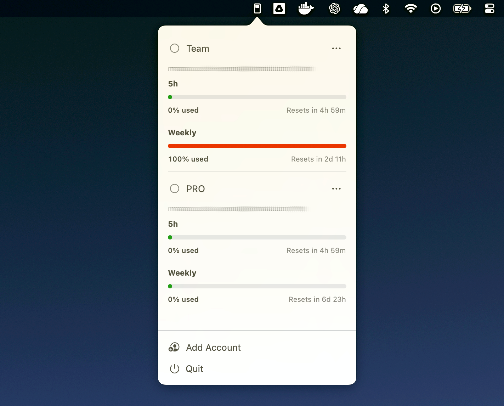

# Codex Switcher



Codex Switcher is a lightweight macOS menubar app to manage multiple Codex accounts without leaving your current workflow.

What it does:
- Keeps your Codex accounts in one place.
- Shows Daily and Weekly usage per account.
- Lets you switch account from the tray in one click.
- If Codex is actively running, it asks for confirmation before switching, then stops/relaunches Codex safely.

Build and install locally from source:

```bash
git clone <repo-url>
cd cs
./scripts/build-local-installer.sh
open "dist/Codex Switcher.dmg"
```

Then drag `Codex Switcher.app` into `Applications`.

Notes:
- This is a local unsigned build.
- The script embeds the switcher symbol (`lightswitch.on`) as the app icon.
- If macOS blocks first launch, right-click the app once and choose **Open**.
